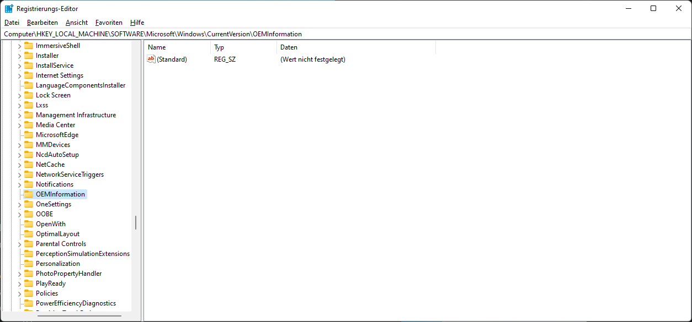
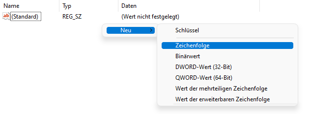
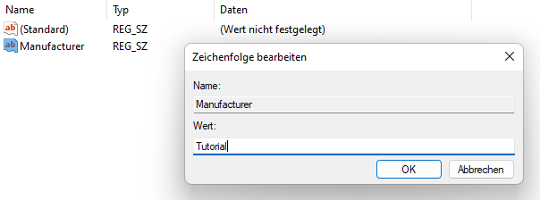

# OEMInformation einrichten

* Drücke `Windows` + `R` und gebe folgendes ein:

```bash
regedit
```

* Nachdem `regedit` (Registrierungseditor) geöffnet ist, navigiere in diesem Path:

```bash
HKEY_LOCAL_MACHINE\SOFTWARE\Microsoft\Windows\CurrentVersion\OEMInformation
```


* Du hast nun Folgende Möglichkeiten einzutragen:

1. Logo
2. Manufacturer
3. Model
4. SupportHours
5. SupportPhone
6. SupportURL


Wichtig ist hierbei, dass ihr beim Erstellen der Datei die String Value erstellt und die Datei genau so heißt wie oben die Möglichkeiten. Im Bereich Value (Wert) kann man beliebige Wörter eintragen.





* Die Informationen kann man aufrufen, indem man wie wie gefolgt navigiert.

```bash
Systemsteuerung -> System und Sicherheit -> System
```


* Im Abbild wurde hinzufügend `SupportURL` & `SupportPhone` eingetragen.
